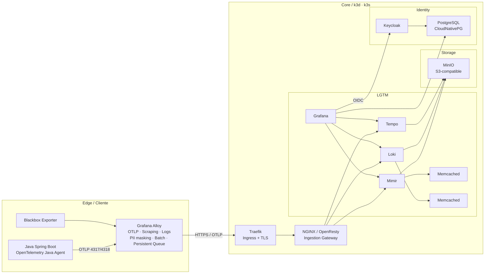
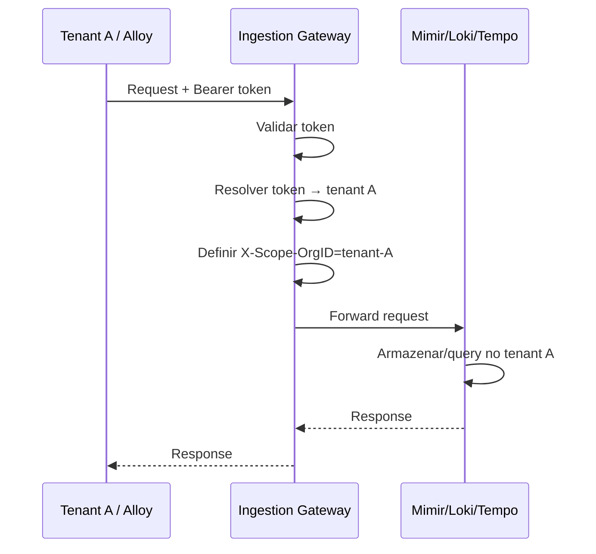
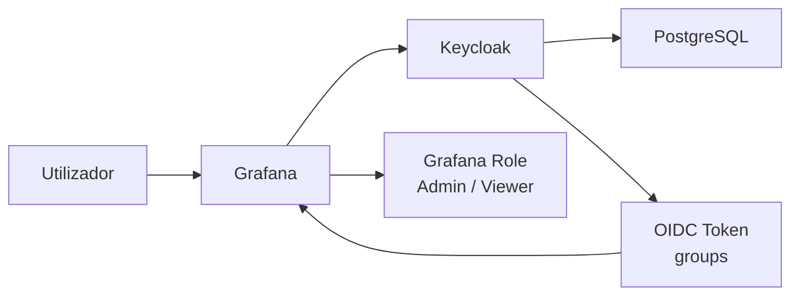
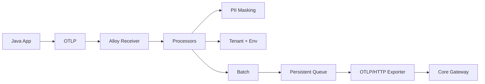
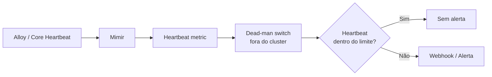

# Diagrams

## 1. Arquitectura geral

```mermaid
flowchart LR
    subgraph EDGE["Edge / Cliente"]
        APP["Java Spring Boot<br/>OpenTelemetry Java Agent"]
        ALLOY["Grafana Alloy<br/>OTLP · Scraping · Logs<br/>PII masking · Batch · Persistent Queue"]
        BB["Blackbox Exporter"]

        APP -->|OTLP 4317/4318| ALLOY
        BB --> ALLOY
    end

    subgraph CORE["Core / k3d · k3s"]
        TRAEFIK["Traefik<br/>Ingress + TLS"]
        GW["NGINX / OpenResty<br/>Ingestion Gateway"]

        subgraph LGTM["LGTM"]
            MIMIR["Mimir"]
            LOKI["Loki"]
            TEMPO["Tempo"]
            GRAFANA["Grafana"]
            MC1["Memcached"]
            MC2["Memcached"]
        end

        subgraph STORAGE["Storage"]
            MINIO["MinIO<br/>S3-compatible"]
        end

        subgraph IDENTITY["Identity"]
            KC["Keycloak"]
            PG["PostgreSQL<br/>CloudNativePG"]
        end

        TRAEFIK --> GW
        GW --> MIMIR
        GW --> LOKI
        GW --> TEMPO

        MIMIR --> MC1
        LOKI --> MC2

        MIMIR --> MINIO
        LOKI --> MINIO
        TEMPO --> MINIO

        GRAFANA --> MIMIR
        GRAFANA --> LOKI
        GRAFANA --> TEMPO

        GRAFANA -->|OIDC| KC
        KC --> PG
        GRAFANA --> PG
    end

    ALLOY -->|HTTPS / OTLP| TRAEFIK
```

## 2. Fluxo de multi-tenancy

```mermaid
sequenceDiagram
    participant A as Tenant A / Alloy
    participant G as Ingestion Gateway
    participant M as Mimir/Loki/Tempo

    A->>G: Request + Bearer token
    G->>G: Validar token
    G->>G: Resolver token → tenant A
    G->>G: Definir X-Scope-OrgID=tenant-A
    G->>M: Forward request
    M->>M: Armazenar/query no tenant A
    M-->>G: Response
    G-->>A: Response
```

## 3. Identity flow

```mermaid
flowchart LR
    USER["Utilizador"] --> G["Grafana"]
    G --> KC["Keycloak"]
    KC --> PG["PostgreSQL"]
    KC --> TOKEN["OIDC Token<br/>groups"]
    TOKEN --> G
    G --> ROLE["Grafana Role<br/>Admin / Viewer"]
```

## 4. Telemetry pipeline

```mermaid
flowchart LR
    J["Java App"] --> OTLP["OTLP"]
    OTLP --> R["Alloy Receiver"]

    R --> P["Processors"]
    P --> PII["PII Masking"]
    P --> ATTR["Tenant + Env"]
    P --> BATCH["Batch"]

    BATCH --> Q["Persistent Queue"]
    Q --> EXP["OTLP/HTTP Exporter"]
    EXP --> GW["Core Gateway"]
```

## 5. Failure / dead-man switch

```mermaid
flowchart LR
    AL["Alloy / Core Heartbeat"] --> M["Mimir"]
    M --> H["Heartbeat metric"]

    H --> D["Dead-man switch<br/>fora do cluster"]
    D --> C{"Heartbeat<br/>dentro do limite?"}

    C -->|Sim| OK["Sem alerta"]
    C -->|Não| ALERT["Webhook / Alerta"]
```
